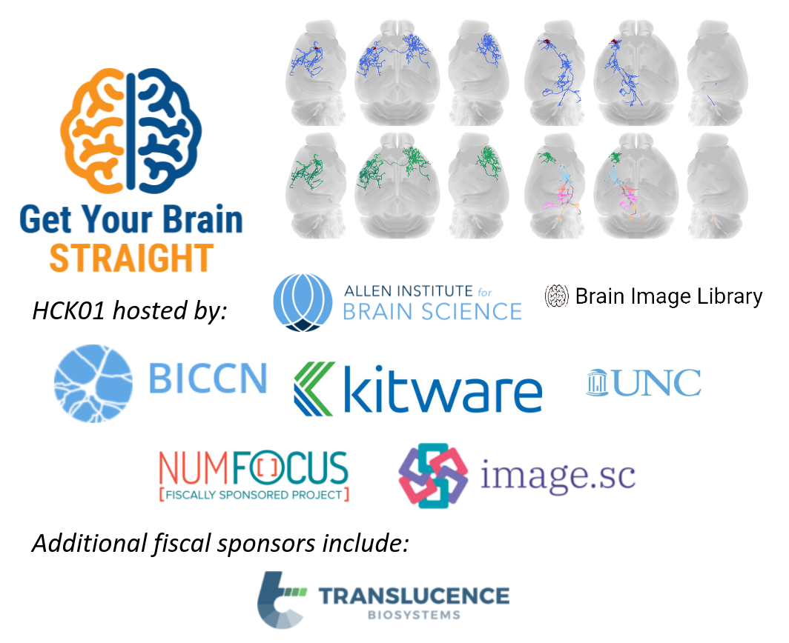

# Welcome to the web page for the 1st Get Your Brain Straight Hackathon !

## What?

The **Get Your Brain Straight** hackathons **bring together neuroimage data
generators, image registration researchers, and neurodata compute
infrastructure providers for a hands-on, collaborative event**. This community
collaboration aims to **create reproducible, open source resources** that enable
discovery of the structure and function of brains.

There are three components to the hackathon.
First, the primary goal of each hackathon is the generation of a **Reproducible Resource** for registration and analysis of
a specific brain imaging modality.
**Tutorial** sessions share how to work with open source registration tools, open access datasets, or neurodata
archives.
**Birds-of-a-Feather (BOF) Breakout** sessions enable participants
interested in collaborating to work on relevant topics.

**Example ways to participate:**

* [Contribute a registration pipeline resource](https://insightsoftwareconsortium.github.io/GetYourBrainStraight/HCK01_2022_Virtual/#reproducible-resource-challenge-fmost-mouse-brain-registration-to-ccfv3) that can be deployed on Brain Imaging Library (BIL) resources to register the challenge dataset.
* [Give a tutorial](https://insightsoftwareconsortium.github.io/GetYourBrainStraight/HCK01_2022_Virtual/#tutorials) about your registration tools. A pre-recorded or live presentation, along with example code and recipes, can teach a data analyst how to run your tool and use the output on the challenge dataset and/or another open dataset.
* [Come and learn](https://insightsoftwareconsortium.github.io/GetYourBrainStraight/HCK01_2022_Virtual/#birds-of-a-feather-breakouts) about registration from experts in the field.

## When, where, how much?

- **Dates:** Monday, April 4th - Thursday, April 7th, 2022

- **Location:** The first hackathon will be online, held on [Google
  Meet](https://meet.google.com/) videoconferencing, [Image.sc Island Gather.Town](https://j.mp/imagesc-island) virtual space, and
  [Image.sc Zulip Chat](https://imagesc.zulipchat.com/).

- **Registration:** Fees: none, it's free! Use [this form](https://forms.gle/eJEf7yQq4UeSc1zF9) to register. Deadline: April 2nd.

- **Communication:** to receive information about this and future events please join the [Hackathon Mailing List](https://groups.google.com/g/brain_straight_hackathon_announcements). Join us on Monday, March 21st at 12PM Pacific Time
[on this Zoom link](https://alleninstitute-org.zoom.us/j/97684575561?pwd=QVZSK3VEcXlEL3c2QW13b2c3U3pvdz09) for a hackathon pre-meeting meet-up for participants to solidify plans, meet each other, and and communicate with the organizers.

## How does it work?

### Before the Hackathon

- [Register](https://forms.gle/eJEf7yQq4UeSc1zF9) for the event. There is no
  cost.
- Sign up for the [mailing list](https://groups.google.com/g/brain_straight_hackathon_announcements).
- [Set up an account](https://www.brainimagelibrary.org/computevisual.html) at the Brain Image Library (BIL).
- Attend the pre-hackathon planning meeting on Monday, March 21st, 12 PM Pacific Time: [Zoom Link](https://alleninstitute-org.zoom.us/j/97684575561?pwd=QVZSK3VEcXlEL3c2QW13b2c3U3pvdz09).
- Optionally prepare a tutorial or organize a Birds-of-a-Feather (BoF) Breakout, described below.

### During the Hackathon

The week will start 8 AM Pacific Time, 11 AM Eastern Time, Monday, April 4th
in an introductory all-hands videoconference.

Following the introduction, participate in the [Reproducible Resource
Challenge](#reproducible-resource-challenge-fmost-mouse-brain-registration-to-ccfv3), join the [tutorials](#tutorials), and participate [BoF breakouts](#birds-of-a-feather-breakouts).

On Thursday, 11 AM Pacific Time, 2 PM Eastern Time, participants will delegate one member to present their registration processing pipelines, results, and discuss lessons learned.

## Who can attend?

Get Your Brain Straight hackathons are open to all and publicly advertised. Email announcements are sent to the [mailing list](https://groups.google.com/g/brain_straight_hackathon_announcements).

## Agenda

<!--
Adapted from https://stackoverflow.com/questions/31821974/support-user-time-zone-in-embedded-google-calendar
https://github.com/NA-MIC/ProjectWeek/blob/b4295bddc01542ebb471d57169954b2770fd81fa/PW36_2022_Virtual/README.md
-->

<!--
<iframe src="https://calendar.google.com/calendar/embed?height=600&wkst=1&bgcolor=%23ffffff&ctz=America%2FNew_York&mode=WEEK&showNav=0&showTabs=1&showCalendars=0&title=1st%20Get%20Your%20Brain%20Straight%20Hackathon&src=Y18zcjNyNzNycTRpbXN0cjkxMjVxOXY2ZDk4NEBncm91cC5jYWxlbmRhci5nb29nbGUuY29t&color=%23F6BF26" style="border:solid 1px #777" width="800" height="600" frameborder="0" scrolling="no"></iframe>
-->

[How to add this calendar to your own?](../common/Calendar.md)
## Reproducible Resource Challenge: fMOST Mouse Brain Registration to CCFv3

This aim of this hackathon is to generate reproducible pipelines
to register [fMOST mouse
brains](https://knowledge.brain-map.org/data/K1YP17A0QIKJOMOAIS4/summary) to the [CCFv3](https://doi.org/10.1016/j.cell.2020.04.007).

The fMOST brain volumes and CCFv3 atlas for the hackathon are available [on the BIL here](https://download.brainlib.org/hackathon/2022_GYBS/data/).

In order to work with the neuroimage data generators, these pipelines will take a standardized input without assumptions of directory structures, filenames, etc and generate standardized outputs.
The input is a single fMOST NIFTI brain volume. Expected outputs include: resampled brain, spatial transformation, and a manifest of outputs.
The processing pipelines should be designed to executed in independently in parallel. The output should be a resampled image with the same size, orientation, and origin as the provided CCFv3.
The output should include an affine transformation file and a deformation field transformation file to transform SWC and/or annotation files from the subject fMOST image space into the CCFv3 space.

Criteria for inclusion in a summary paper:

- [ ] Open source with an [OSI-approved license](https://opensource.org/licenses)
  - The code can be executed in the future
  - Researchers can understand what the code is doing
  - Researchers can extend or fix as needed
- Works on open standard data formats used by data providers and consumers
  - [ ] NIFTI images
- Deployable
  - Can be executed across many environments
  - [ ] Provided in a published [singularity](https://sylabs.io/guides/2.6/user-guide/introduction.html) image
- [ ] Can be executed by an independent analyst on the BIL

The primary goals for this hackathon is to ensure that everyone's code can run on the dataset provided and can be replicated.

In future hackathons, we will focus on:

- Combine registration results and methods
- Quantification and characterization of deformation patterns in fMOST imaging
- Identify biologically relevant regions where improvements need to be made
- Focus on accuracy quantification leading to potential improvements

<a name="reproducible-resource-list"/>

[How to add a new reproducible registration processing pipeline?](./ReproducibleResource/README.md)

## Tutorials

Tutorial sessions share how to work with open source registration tools, open access datasets, or neurodata

<a name="tutorials-list"/>

<a name="how-to-add-a-tutorial"/>

[How to add a new tutorial?](./Tutorials/README.md)

## Birds-of-a-Feather Breakouts

Birds-of-a-Feather (BOF) breakout sessions enable participants
interested in collaborating to work on relevant topics.

To lead or join a Birds-of-a-Feather (BoF) breakout session, create or join a
topic [in this
spreadsheet](https://docs.google.com/spreadsheets/d/1uthoU0CbY-sN5e4neY70IsHKPPXkR21fkcamMDJtmrg/edit#gid=0).
During the BoF, find the leader by clicking on their name in the [Image.sc Island Gather.Town](https://j.mp/imagesc-island) and moving towards their avatar with the keyboard arrow keys. When you are close to their avatar in the virtual space, you will be able to see, hear, and talk to each other.

If notes are taken during the BoF, please add them to the [BoF breakouts
folder](./BoFBreakouts). We recommend [HackMD](https://hackmd.io/) for collaborative,
well-formatted notetaking.
    
## Code of Conduct
    
Participants and contributors are expected to adhere to the [ITK Code of Conduct](https://github.com/InsightSoftwareConsortium/ITK/blob/master/CODE_OF_CONDUCT.md).

## Acknowledgements

This hackathon is supported by the National Institute of Mental Health (NIMH) of the National Institutes of Health (NIH) under the [BRAIN Initiative](https://braininitiative.nih.gov/) award numbers [1RF1MH126732](https://projectreporter.nih.gov/project_info_description.cfm?aid=10259930), [1U19MH114830-01](https://projectreporter.nih.gov/project_info_description.cfm?aid=9416007), [5R24MH114793-02](https://reporter.nih.gov/project-details/9567623), [1U24MH114827-01](https://reporter.nih.gov/project-details/9415946) and the [BICCN](https://biccn.org/).

Additional sponsors include:

[Translucence Biosystems](https://www.translucencebio.com/)

