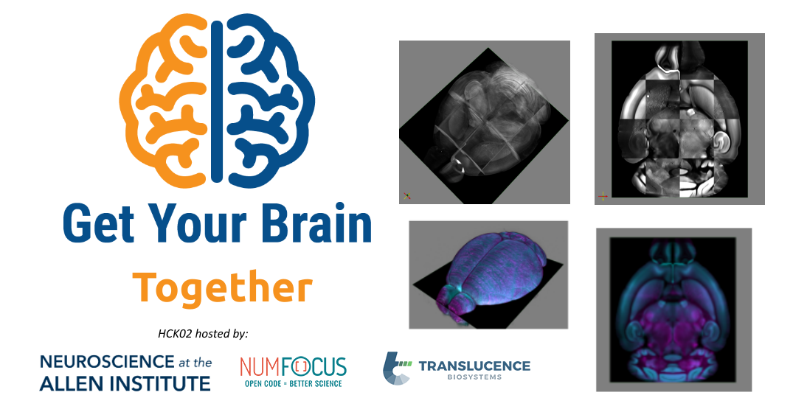

# Welcome to the web page for the 2nd Get Your Brain Together Hackathon !

## What?

The **Get Your Brain Together** hackathons **bring together neuroimage data
generators, image registration researchers, and neurodata compute
infrastructure providers for a hands-on, collaborative event**. This community
collaboration aims to **create reproducible, open source resources** that enable
discovery of the structure and function of brains.

There are three components to the hackathon.
First, the primary goal of each hackathon is the generation of a **Reproducible Resource** for registration and analysis of
a specific brain imaging modality.
**Tutorial** sessions share how to work with open source registration tools, open access datasets, or neurodata
archives.
**Birds-of-a-Feather (BOF) Breakout** sessions enable participants
interested in collaborating to work on relevant topics.

**Example ways to participate:**

* [Contribute a registration pipeline resource](https://insightsoftwareconsortium.github.io/GetYourBrainTogether/HCK02_2023_Allen_Institute_Hybrid/#reproducible-resource-challenge) to register the challenge datasets.
* [Give a tutorial](https://insightsoftwareconsortium.github.io/GetYourBrainTogether/HCK02_2023_Allen_Institute_Hybrid/#tutorials) about your registration tools. A pre-recorded or live presentation, along with example code and recipes, can teach a data analyst how to run your tool and use the output on the challenge dataset and/or another open dataset.
* [Come and learn](https://insightsoftwareconsortium.github.io/GetYourBrainTogether/HCK02_2023_Allen_Institute_Hybrid/#birds-of-a-feather-breakouts) about registration from experts in the field.

## When, where, how much?

- **Dates:** Monday, May 22nd - Tuesday, May 23, 2023

- **Location:** The second hackathon will be a hybrid in-person and online event, held:
  * At the [Allen Institute in Seattle, WA, USA](https://alleninstitute.org/)
  * On [Zoom](https://alleninstitute-org.zoom.us/j/96111568520?pwd=c2U2UXlFWmdHWVhjWWNUL3V2OWJQZz09) videoconferencing
  * [Image.sc Island Gather.Town](https://j.mp/imagesc-island) virtual space, and

  * [Image.sc Zulip Chat](https://imagesc.zulipchat.com/).

If travelling to attend in-person,
- [Courtyard by Marriott Seattle Downtown/Lake Union](https://goo.gl/maps/mAgTi3ZHWvBCC5Fq8)
- [EVEN Hotel Seattle - South Lake Union, an IHG Hotel](https://www.reservationdesk.com/hotel/6255f19/even-hotel-seattle-south-lake-union-seattle-wa/)
- [Astra Hotel Seattle](https://astrahotelseattle.com/)
- [Pan Pacific Seattle](https://www.panpacific.com/en/hotels-and-resorts/pp-seattle.html)
are among nearby hotels.

- **Lead organizers / contacts:** Matt McCormick (Kitware), Sharmishtaa Seshamani (Allen Institute for Neural Dynamics)

- **Registration:** Limited seats will be available for in-person attendance. Registration details will be announced in the mailing list below.

- **Communication:** to receive information about this and future events please join the [Hackathon Mailing List](https://groups.google.com/g/brain_straight_hackathon_announcements).

## How does it work?

### Before the Hackathon

- Register for the event.
- Sign up for the [mailing list](https://groups.google.com/g/brain_straight_hackathon_announcements).
- Optionally prepare a tutorial or organize a Birds-of-a-Feather (BoF) Breakout.

### During the Hackathon

The week will start 9 AM Pacific Time, 12 AM Eastern Time, Monday, May 22nd
in an introductory all-hands videoconference.

Following the introduction, participate in the Reproducible Resource
Challenge, join the tutorials, and take part in BoF breakouts. Please bring a laptop.

At the end of the day on Tuesday, participants will delegate one member to present their registration processing pipelines, results, and discuss lessons learned.

## Who can attend?

Get Your Brain Together hackathons are open to all and publicly advertised. Email announcements are sent to the [mailing list](https://groups.google.com/g/brain_straight_hackathon_announcements).

## Agenda

<!--
Adapted from https://stackoverflow.com/questions/31821974/support-user-time-zone-in-embedded-google-calendar
https://github.com/NA-MIC/ProjectWeek/blob/b4295bddc01542ebb471d57169954b2770fd81fa/PW36_2022_Virtual/README.md
-->

<!--
<iframe src="https://calendar.google.com/calendar/embed?height=600&wkst=1&bgcolor=%23ffffff&ctz=America%2FNew_York&mode=WEEK&showNav=0&showTabs=1&showCalendars=0&title=1st%20Get%20Your%20Brain%20Together%20Hackathon&src=Y18zcjNyNzNycTRpbXN0cjkxMjVxOXY2ZDk4NEBncm91cC5jYWxlbmRhci5nb29nbGUuY29t&color=%23F6BF26" style="border:solid 1px #777" width="800" height="600" frameborder="0" scrolling="no"></iframe>
-->

[How to add this calendar to your own?](../common/Calendar.md)

## Reproducible Resource Challenge

This aim of this hackathon is to generate reproducible pipelines to register whole-brain lightsheet
microscopy image data to the [CCFv3](https://doi.org/10.1016/j.cell.2020.04.007). Two datasets are provided,
each with their unique quirks. You may work on either dataset during the hackathon.

In order to work with the neuroimage data generators, these pipelines will take a standardized input
without assumptions of directory structures, filenames, etc and generate standardized outputs.
Expected outputs include: resampled brain, spatial transformation, and a manifest of outputs. The
processing pipelines should be designed to executed in independently in parallel. The output should
be a resampled image with the same size, orientation, and origin as the provided CCFv3. The output
should include an affine transformation file, and a deformation field transformation file to
transform SWC and/or annotation files from the challenge dataset image space into the CCFv3 space.

Criteria for inclusion in a summary paper:

- [ ] Open source with an [OSI-approved license](https://opensource.org/licenses)
    - The code can be executed in the future
    - Researchers can understand what the code is doing
    - Researchers can extend or fix as needed
- Works on open standard data formats used by data providers and consumers
    - [ ] The provided input NIFTI or OME-NGFF images
    - [ ] Provide outputs in open standard formats on the BIL at `/hackathon/2022_GYBS/output/<team-name>/<dataset>/*`.
- Deployable
    - Can be executed across many environments
    - [ ] Provided in a
      published [singularity](https://sylabs.io/guides/2.6/user-guide/introduction.html) image
- [ ] Can be executed by an independent analyst on the BIL

The primary goals for this hackathon is to ensure that everyone's code can run on the dataset
provided and can be replicated.

## Tutorials

Tutorial sessions share how to work with open source registration tools, open access datasets, or neurodata

<a name="tutorials-list"/>

### Monday 5/22

- About the AIND Lightsheet Challenge Dataset, 9 - 9:30 AM PT, (David Feng)
- About the Translucence Challenge Dataset, 9:30 - 10 AM PT, (Ricardo Azevedo)
- Working with OME-Zarr NGFF, 10 AM - 10:30 AM, (Matt McCormick)

### Tuesday 5/23

- Large Scale Registration, 9 - 9:30 AM PT, (Matt McCormick)
- Registration Quality Metrics, 9:30 - 10 AM PT (Tom Birdsong)

<a name="how-to-add-a-tutorial"/>

[How to add a new tutorial?](./Tutorials/README.md)

## Birds-of-a-Feather Breakouts

Birds-of-a-Feather (BoF) breakout sessions enable participants
interested in collaborating to work on relevant topics.

To lead or join a Birds-of-a-Feather (BoF) breakout session, create or join a
topic [in this
spreadsheet](https://docs.google.com/spreadsheets/d/1-uOH9yGYxomRm55c2EjP1fM4SjSABUtGLbNWMQrU5Oc/edit#gid=0).
During the BoF, find the leader by clicking on their name in the [Image.sc Island Gather.Town](https://j.mp/imagesc-island) and moving towards their avatar with the keyboard arrow keys. When you are close to their avatar in the virtual space, you will be able to see, hear, and talk to each other.

If notes are taken during the BoF, please add them to the [BoF breakouts
folder](./BoFBreakouts). We recommend [HackMD](https://hackmd.io/) for collaborative,
well-formatted notetaking.

## Code of Conduct

Participants and contributors are expected to adhere to the [ITK Code of Conduct](https://github.com/InsightSoftwareConsortium/ITK/blob/master/CODE_OF_CONDUCT.md).

## Acknowledgements

This hackathon is supported by the National Institute of Mental Health (NIMH) of the National Institutes of Health (NIH) under the [BRAIN Initiative](https://braininitiative.nih.gov/) award numbers [1RF1MH126732](https://projectreporter.nih.gov/project_info_description.cfm?aid=10259930), [1U19MH114830-01](https://projectreporter.nih.gov/project_info_description.cfm?aid=9416007), [5R24MH114793-02](https://reporter.nih.gov/project-details/9567623), [1U24MH114827-01](https://reporter.nih.gov/project-details/9415946).
