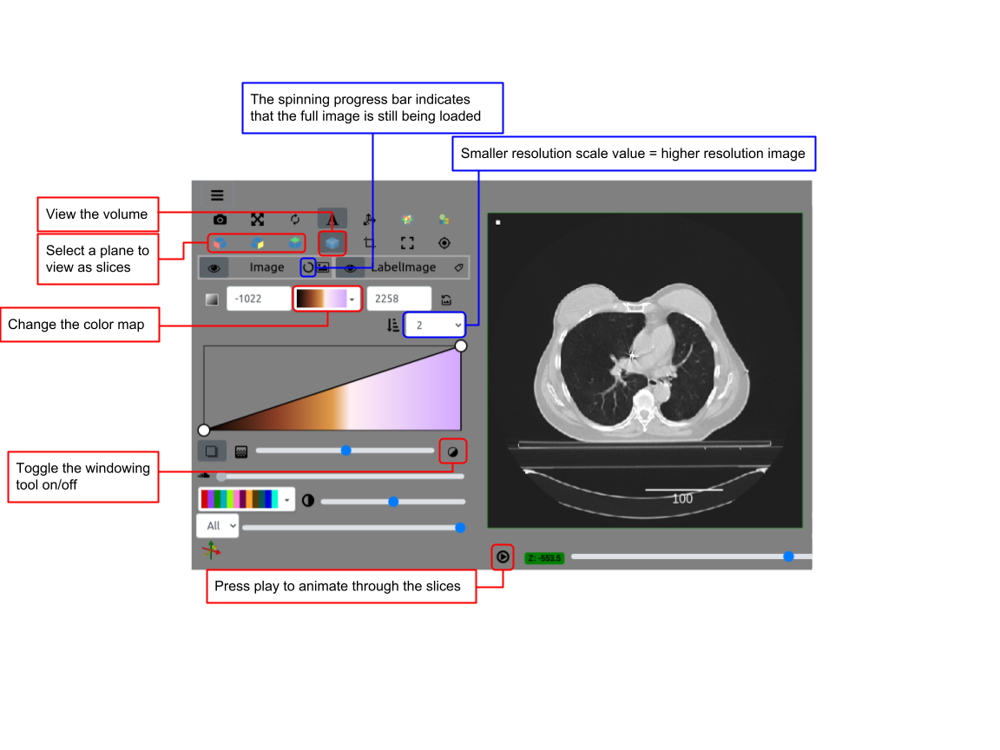

Back to the [Tutorials List](../../README.md#tutorials-list)

# Visualization for Registration and Image Data

## Instructors

- Brianna Major (Kitware)
- Paul Elliott (Kitware)

## Tutorial Description

What does a 3D image look like? How did the image change after processing? Can I share my images with others?

Using [itkwidgets](https://itkwidgets.readthedocs.io/en/latest/), we will demo how to explore images in different data formats.

Duration: 0.5 hours.

## Learning Outcomes

- Display 3D images in Jupyter Notebooks and on a web page.
- Navigation around multi-component images in the 3D view and with 2D slices.
- Adjust rendering parameters: color maps, color ranges, opacity transfer functions and the gradient opacity factor.
- Visualize a "label map" on a image.
- Combine 2 images to compare registration results.

## Approach and Materials

- [Hello itkwidgets notebook](hello-itkwidgets.ipynb)
- [Label map notebook](IDC_Seg_Primer_Examples.ipynb)
- [Compare images notebook](ThinPlateSpline.ipynb)
- [Web viewer](https://kitware.github.io/itk-vtk-viewer/app/) <- itk-vtk-viewer

## Background and References

- [itkwidgets docs](https://itkwidgets.readthedocs.io/en/latest/)
- [itkwidgets code](https://github.com/InsightSoftwareConsortium/itkwidgets)
- [itk-vtk-viewer URL parameter docs](https://kitware.github.io/itk-vtk-viewer/docs/viewer.html)
- [itk-vtk-viewer code](https://github.com/Kitware/itk-vtk-viewer)
