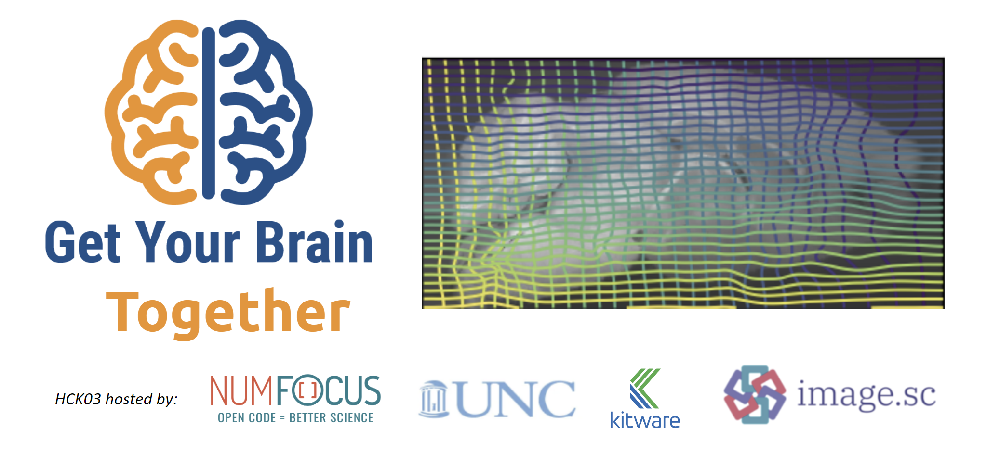

# Welcome to the 3rd Get Your Brain Together Hackathon !

*[Register] now!*

## What?

### Purpose

The **Get Your Brain Together** hackathons **bring together neuroimage data
generators, image registration researchers, and neurodata compute
infrastructure providers for a hands-on, collaborative event**. This community
collaboration aims to **create reproducible, open source resources** that enable
discovery of the structure and function of brains.

This hackathon will focus on **advancing [OME-Zarr] spatial transformations**.

### Motivation

[OME-Zarr] is a cloud-optimized bioimaging file format with international community support and broad adoption across neuroscience. The [current standard] supports large-scale bioimages with spatial metadata. The [coordinate transformations draft] provides a first-class for spatial-transformations in OME-Zarr, which is vitally important for neuroimaging and broader scientific imaging practices to enable:

1. **Reproducibility and Consistency**: Supporting spatial transformations explicitly in a file format ensures that transformations are applied consistently across different platforms and applications. This [FAIR] capability is a cornerstone of scientific research, and having standardized formats and tools facilitates verification of results by independent researchers​​.

2. **Integration with Analysis Workflows**: Having spatial transformations as a first-class citizen within file formats allows for seamless integration with various image analysis workflows. Registration transformations can be used in subsequent image analysis steps without requiring additional conversion.

3. **Efficiency and Accuracy**: Storing transformations within the file format avoids the need for re-sampling each time the data is processed. This reduces sampling errors and preserves the accuracy of subsequent analyses. Standardization enables on-demand transformation, critical for the massive volumes collected by modern microscopy techniques.

4. **Flexibility in Analysis**: A file format that natively supports spatial transformations allows researchers to apply, modify, or reverse transformations as needed for different analysis purposes. This flexibility is critical for tasks such as longitudinal studies, multi-modal imaging, and comparative analysis across different subjects or experimental conditions.

### Agenda

The hackathon is structured into three key components:

1. The first day features **tutorial sessions** designed to impart knowledge on the **application needs** for coordinate transformations, the **mathematical principles** involved, and the **current computational standards and tools** available in the open-source ecosystem.
2. On the second day, small working groups will **review and propose enhancements** to the current [coordinate transformations draft] and [relevant neuroimaging additions].
3. The third day will be dedicated to hands-on activities, during which participants will **implement and apply** the proposed improvements to the standards.

<!--
Adapted from https://stackoverflow.com/questions/31821974/support-user-time-zone-in-embedded-google-calendar
https://github.com/NA-MIC/ProjectWeek/blob/b4295bddc01542ebb471d57169954b2770fd81fa/PW36_2022_Virtual/README.md
-->

<!--
<iframe src="https://calendar.google.com/calendar/embed?height=600&wkst=1&bgcolor=%23ffffff&ctz=America%2FNew_York&mode=AGENDA&showNav=0&showTabs=1&showCalendars=0&title=1st%20Get%20Your%20Brain%20Together%20Hackathon&src=Y18zcjNyNzNycTRpbXN0cjkxMjVxOXY2ZDk4NEBncm91cC5jYWxlbmRhci5nb29nbGUuY29t&color=%23F6BF26" style="border:solid 1px #777" width="800" height="600" frameborder="0" scrolling="no"></iframe>
-->

[How to add this calendar to your own?](../common/Calendar.md)

## When, where, how much?

- **Dates:**
  * Friday, July 26th - Sunday, July 28th, 2024
  * Details in the calendar below

- **Location:** The second hackathon will be a hybrid in-person and online event, held:
  * At the [University of North Carolina-Chapel
    Hill](https://www.unc.edu/visitors/).
  * On [Google Meet videoconferencing](https://meet.google.com/jtd-ckkd-xjf)
  * [Image.sc Island Gather.Town](https://j.mp/imagesc-island) virtual space (see this quick [Intro to Gather Town](https://docs.google.com/document/d/1QeDJXPKSdcRAINPeCNnWcNmVlCfjrc5abrHnEG39ABA/edit?usp=sharing), and
  * [Image.sc Zulip Chat](https://imagesc.zulipchat.com/#narrow/stream/446321-.5B2024-07.5D-Get-Your-Brain-Together-Hackathon-03).

If travelling to attend in-person nearby hotels include:

  * [Hampton Inn & Suites, Chapel Hill](https://www.hilton.com/en/hotels/rducohx-hampton-suites-chapel-hill-carrboro-downtown/?SEO_id=GMB-AMER-HX-RDUCOHX&y_source=1_MjA4Mzg2Mi03MTUtbG9jYXRpb24ud2Vic2l0ZQ%3D%3D)
  * [The Carolina Inn, Chapel Hill](https://www.hyatt.com/en-US/hotel/north-carolina/the-carolina-inn/rdudc?src=corp_lclb_gmb_seo_rdudc)

- **Lead organizers / contacts:** Matt McCormick (Kitware), Marc Niethammer (UNC)

- **Cost:** *[Registration] is free!*

## How does it work?

### Before the Hackathon

- [Register] for the event.
- Sign up for the [mailing list](https://groups.google.com/g/brain_straight_hackathon_announcements).
- Optionally [prepare a tutorial](https://github.com/InsightSoftwareConsortium/GetYourBrainTogether/issues/new?assignees=thewtex&labels=tutorial%2Cevent%3AHCK03_2024_UNC&projects=&template=schedule-a-tutorial.yml&title=Tutorial%3A+My+tutorial+name).

### Who can attend?

Get Your Brain Together hackathons are open to all and publicly advertised. Email announcements are sent to the [mailing list](https://groups.google.com/g/brain_straight_hackathon_announcements).

## Tutorials

<a name="tutorials-list"/>

### Friday 7/26

BigWarp and Ome-Zarr: a match made in Fiji - 11:00 AM ET - John Bogovic, Janelia Research
: BigWarp is a Fiji / Java tool for manual, deformable 2D and 3D image registration. This tutorial will highlight the ways BigWarp uses the draft transformation specification for import and export. In particular, I will show a use case where, given a moving image, a target image, and a set of transformations, bigwarp automatically determines which transformations to apply, in what direction (forward or inverse), and in what order. We will discuss how the Ome-Zarr transformation specification enables this functionality. If there is time and interest, I will show how BigWarp interpolates two transformations using a mask image, and how decomposing transformations into parts results in nicer behavior.

## Code of Conduct

Participants and contributors are expected to adhere to the [ITK Code of Conduct](https://github.com/InsightSoftwareConsortium/ITK/blob/master/CODE_OF_CONDUCT.md).

## Acknowledgements

This hackathon is supported by the National Institute of Mental Health (NIMH) of the National Institutes of Health (NIH) under the [BRAIN Initiative](https://braininitiative.nih.gov/) award numbers [1RF1MH126732](https://projectreporter.nih.gov/project_info_description.cfm?aid=10259930).

[OME-Zarr]: http://dx.doi.org/10.1007/s00418-023-02209-1
[current standard]: https://ngff.openmicroscopy.org/latest/
[coordinate transformations draft]: https://github.com/ome/ngff/pull/138
[relevant neuroimaging additions]: https://github.com/ome/ngff/issues/208
[FAIR]: https://www.ncbi.nlm.nih.gov/pmc/articles/PMC4792175/
[Registration]: https://forms.gle/LL4quQsbSWawKYSa6
[Register]: https://forms.gle/LL4quQsbSWawKYSa6
