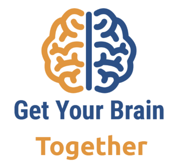

## Introduction

#### What?

The **Get Your Brain Together** hackathons **bring together neuroimage data
generators, image registration researchers, and neurodata compute
infrastructure providers for a hands-on, collaborative event**. This community
collaboration aims to **create reproducible, open source resources** that enable
discovery of the structure and function of brains.

There are three components to the hackathons.

1. **Tutorial** sessions share computational and biological knowledge around open source registration tools, open access datasets, or neurodata archives.
2. **Birds-of-a-Feather (BOF) Breakout** sessions enable participants interested in collaborating to work on relevant topics.
3. Each hackathon generates a **Reproducible Resource** for registration and analysis of neuroimaging datasets.

## Hackathon Events

### Upcoming Events

- [Hackathon 3: July 2024](HCK03_2024_UNC_Hybrid/README.md){:target="_top"} - The **3rd Hackathon** will be held at the University of North Carolina-Chapel Hill and online July 26-28th, 2024.

### Past Events

- [Hackathon 2: May 2023](HCK02_2023_Allen_Institute_Hybrid/README.md){:target="_top"} - The **2nd Hackathon** was held at the Allen Institute and online May 22nd-23rd, 2023.
- [Hackathon 1: March 2022](HCK01_2022_Virtual/README.md){:target="_top"} - The **1st Hackathon** will be held April 4th-7th online.

#### What is the history of the hackathons?

This hackathon is inspired by and based on the successful [NeurodataWithoutBorders (NWB)](https://neurodatawithoutborders.github.io/nwb_hackathons/) and [NA-MIC Project Week](https://projectweek.na-mic.org/) hackathons.

---

This page is hosted from the InsightSoftwareConsortium organization's [GetYourBrainTogether](https://github.com/InsightSoftwareConsortium/GetYourBrainTogether) repository on github.com and is published at [insightsoftwareconsortium.github.io/GetYourBrainTogether/](https://insightsoftwareconsortium.github.io/GetYourBrainTogether/)
